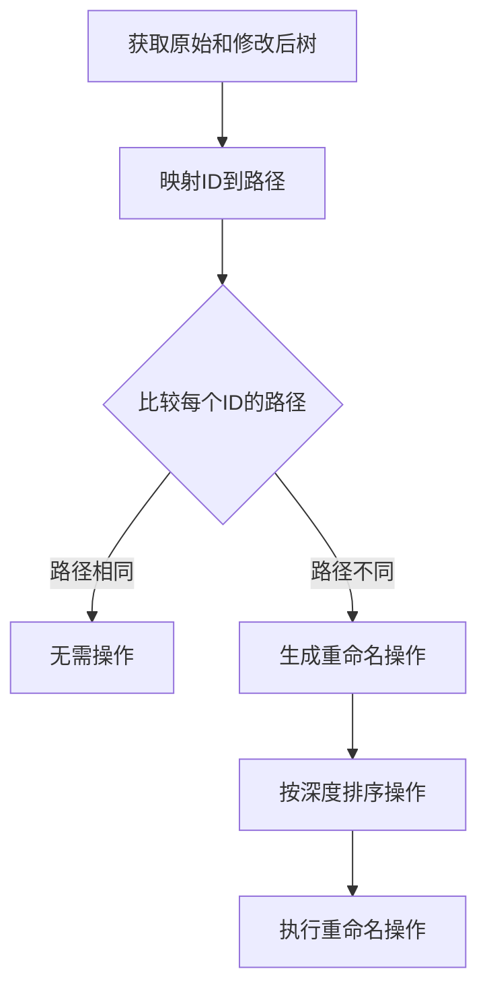
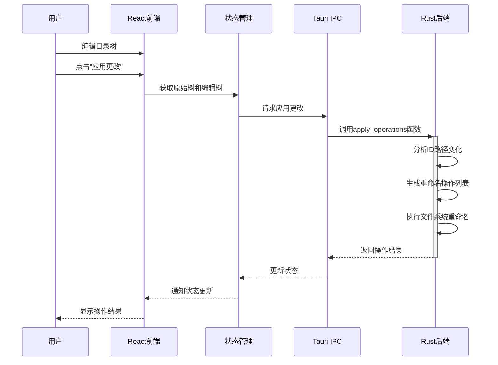
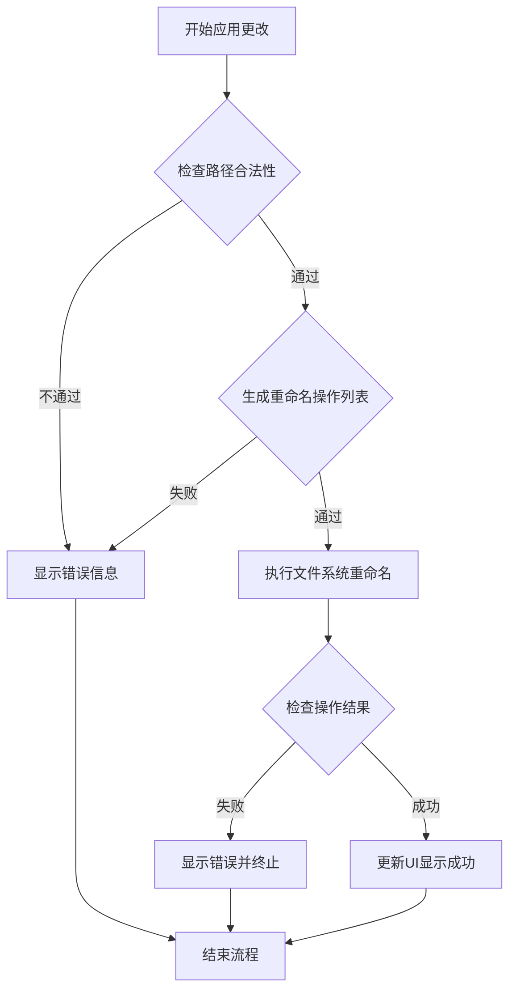
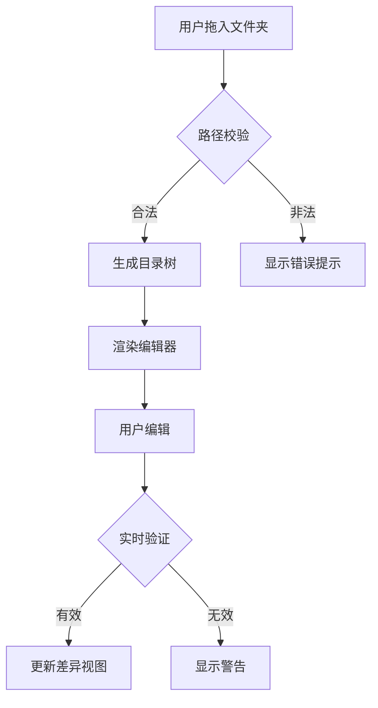
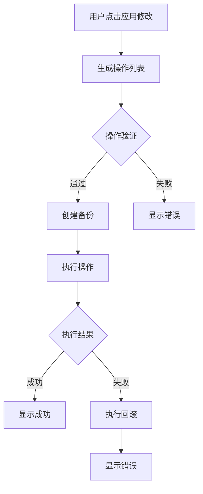

# TreeNamer 技术方案设计

## 一、系统架构

### 1. 整体架构图

```plaintext
+-------------------------+
|      前端 (Web View)     |
|     (Tauri + React UI)  |
+-------------------------+
|  - 目录树编辑器          |  ← 基于Monaco Editor
|  - Diff对比视图          |  ← 集成diff-match-patch
|  - 用户交互逻辑          |
+------------+------------+
             ↑ Tauri API 调用
             | (命令调用/事件监听)
+------------+------------+
|    共享内存区域          | ← 大型目录数据交换
+------------+------------+
|       后端 (Rust)        |
+-------------------------+
|  - 文件系统操作          |  ← std::fs模块
|  - 目录树解析器          |  ← 自定义递归扫描器
+-------------------------+
```

### 2. 项目文件结构

```
treenamer/
├── src/                      # 前端React代码
│   ├── components/           # UI组件
│   │   ├── Editor/           # Monaco编辑器组件
│   │   ├── DiffView/         # 差异可视化组件
│   │   ├── FileTree/         # 目录树组件
│   │   └── common/           # 共享UI组件
│   ├── hooks/                # 自定义React hooks
│   ├── store/                # 状态管理
│   ├── utils/                # 工具函数
│   ├── styles/               # 全局样式
│   ├── App.tsx               # 主应用组件
│   └── main.tsx              # 入口点
├── src-tauri/                # Rust后端代码
│   ├── src/
│   │   ├── main.rs           # 入口点
│   │   ├── commands/         # Tauri命令
│   │   │   ├── mod.rs        # 命令模块聚合
│   │   │   ├── fs.rs         # 文件系统操作
│   │   │   └── tree.rs       # 目录树解析
│   │   ├── error.rs          # 统一错误处理模块
│   │   └── utils/            # 工具函数
│   ├── Cargo.toml            # Rust依赖
│   └── tauri.conf.json       # Tauri配置
├── public/                   # 静态资源
├── tests/                    # 测试文件
│   ├── unit/                 # 单元测试
│   └── e2e/                  # 端到端测试
├── package.json              # Node.js依赖
├── .vscode/                  # VSCode配置
│   └── launch.json           # 调试配置
└── README.md                 # 项目文档
```

## 二、核心模块设计

### 1. 目录树解析器

#### 输入输出

- **输入**：文件夹绝对路径  
- **输出**：标准化目录树文本（符合tree命令格式）  
- **示例**：

  ```rust
  // 目录选项结构体
  pub struct DirectoryOptions {
      pub max_depth: usize,
      pub exclude_pattern: Regex,  // 使用正则而非字符串
      pub follow_symlinks: bool,
      pub show_hidden: bool,
  }
  
  // 生成逻辑 (Rust)
  fn parse_directory(path: &str, options: DirectoryOptions) -> Result<String, Error> {
      // 实现目录解析逻辑
  }
  
  // 并行扫描实现
  fn parallel_scan(dir: &Path, options: &DirectoryOptions) -> Result<Vec<DirEntry>> {
      WalkDir::new(dir)
          .max_depth(options.max_depth)
          .follow_links(options.follow_symlinks)
          .parallelism(Parallelism::RayonNewPool(4))
          .into_iter()
          .filter_entry(|e| !options.exclude_pattern.is_match(e.path().to_str().unwrap_or("")))
          .collect()
  }
  
  // 前端调用 (JavaScript)
  invoke('parse_directory', { 
    path: '/projects',
    options: {
      maxDepth: 5,
      excludePattern: 'node_modules|.git',
      followSymlinks: false,
      showHidden: false
    }
  });
  ```

#### 关键技术点

- **递归扫描**：使用`ignore`库替代原生`std::fs::read_dir`，支持`.gitignore`式过滤
- **符号统一化**：将Windows路径分隔符`\`转换为`/`
- **性能优化**：利用Rust的Rayon并行迭代器处理大型目录，明确线程池配置

### 2. 编辑器内核

#### Monaco Editor集成方案

```javascript
// 初始化双编辑器实例
const originalEditor = monaco.editor.create(leftPanel, {
  value: initialTreeText,
  readOnly: true,
  minimap: { enabled: false }
});

const editableEditor = monaco.editor.create(rightPanel, {
  value: initialTreeText, 
  multiCursorModifier: 'ctrlCmd',
  quickSuggestions: false
});

// 实时Diff计算
editableEditor.onDidChangeModelContent(() => {
  const diffs = diff.diff_main(
    originalEditor.getValue(),
    editableEditor.getValue()
  );
  renderDiffDecorations(diffs);
});
```

#### 多光标与正则替换

- **多光标**：继承Monaco原生支持（`Ctrl+Click`/`Alt+拖动`）
- **正则替换**：调用`editor.trigger`执行替换命令

  ```javascript
  editor.trigger('keyboard', 'actions.find', {
    searchString: regex,
    replaceString: replacement,
    isRegex: true
  });
  ```

### 3. 差异对比引擎

#### 明确实体跟踪方案

| 实体类型      | 跟踪方式                               |
|---------------|--------------------------------------|
| 文件实体      | 唯一ID + 原始路径与当前路径的映射关系     |
| 目录实体      | 唯一ID + 父子关系树 + 路径映射          |
| 操作类型      | 基于路径变化显式判定，无需推断            |

**数据结构:**

```typescript
interface FileSystemEntity {
  id: string;               // 唯一标识符
  originalPath: string;     // 原始完整路径
  currentPath: string;      // 当前/修改后完整路径
  isDirectory: boolean;     // 是否为目录
  parentId: string | null;  // 父节点引用
  children: string[];       // 子节点ID数组
}
```

#### 操作生成逻辑

```rust
// 基于路径变化显式生成操作
fn generate_operations(entities: &[FileSystemEntity]) -> Vec<FileOperation> {
    let mut operations = Vec::new();
    
    // 处理重命名操作
    for entity in entities {
        if entity.original_path != entity.current_path {
            operations.push(FileOperation::Rename {
                from: entity.original_path.clone(),
                to: entity.current_path.clone(),
            });
        }
    }
    
    // 处理删除和创建操作
    // 对于不在原始树中但在当前树的实体，创建操作
    // 对于在原始树中但不在当前树的实体，删除操作
    
    // 按操作顺序进行排序，确保先处理父目录，再处理子文件
    operations.sort_by(|a, b| {
        match (a, b) {
            (FileOperation::Rename { from: a_from, .. }, 
             FileOperation::Rename { from: b_from, .. }) => {
                // 短路径（树中更高层级）优先
                a_from.len().cmp(&b_from.len())
            }
            _ => std::cmp::Ordering::Equal,
        }
    });
    
    operations
}
```

### 4. 文件系统操作器

#### 简化的重命名操作模型

TreeNamer 使用一个简化而精确的操作模型，专注于文件重命名操作：

1. **仅重命名操作**: 系统只执行重命名操作，不需要创建或删除文件
2. **基于唯一ID**: 每个文件或目录都有一个唯一ID，在整个编辑过程中保持不变
3. **路径比较**: 通过比较同一ID在修改前后的路径来检测重命名



关键优势：

- **精确跟踪**: 即使在复杂的重命名场景中也能准确识别变化
- **避免数据丢失**: 不会错误地创建和删除文件
- **操作简化**: 只需处理一种操作类型，降低复杂度

#### 事务性执行流程





## 数据结构与逻辑

### 目录树表示

目录树使用两种形式表示：

1. **后端 JSON 数据结构**：后端使用 Rust 的结构体表示目录树，每个节点包含唯一标识符、名称、类型（文件/目录）和子节点列表。

```rust
struct TreeNode {
    id: String,        // 唯一标识符
    name: String,      // 文件或目录名
    is_dir: bool,      // 是否为目录
    children: Vec<TreeNode>, // 子节点列表
}
```

2. **前端显示格式**：为了用户直观编辑，前端将 JSON 数据转换为类似命令行 `tree` 命令输出的文本格式：

```
root/
├── folder1/
│   ├── file1.txt
│   └── file2.txt
└── folder2/
    └── file3.txt
```

### 实体标识符跟踪 (ID-Based Tracking)

TreeNamer 的核心功能基于唯一标识符跟踪每个文件系统实体：

1. **ID 生成**：首次扫描目录结构时，为每个文件和目录分配唯一ID
2. **ID 稳定性**：在编辑过程中，这些ID保持不变，即使文件名或路径改变
3. **ID-路径映射**：系统维护两个关键映射:
   - 原始树: ID -> 原始路径
   - 修改树: ID -> 新路径

这种方法的主要优势:

- **精确识别变化**: 唯一ID让系统能准确跟踪每个文件，不管它如何重命名或移动
- **消除歧义**: 即使在复杂的批量重命名场景中也能运作正常
- **操作简化**: 只需专注于重命名操作，无需复杂的创建/删除逻辑

### 重命名操作生成

当用户应用更改时，系统:

1. 将前端编辑的文本表示解析回JSON结构，保留实体ID
2. 为每个ID创建路径映射 (原始路径和新路径)
3. 比较每个ID的路径变化:
   - 如果路径不同 → 生成重命名操作
   - 如果路径相同 → 不操作
4. 排序操作以确保正确的执行顺序:
   - 先处理文件，再处理目录
   - 深度路径优先于浅层路径

5. 按顺序执行重命名操作

这种精简的基于ID的方法确保了文件操作的可靠性和准确性，同时保持了简单的实现。

## 三、技术选型决策

### 1. 前后端通信优化

| 场景                | 技术方案                              | 数据格式          |
|---------------------|--------------------------------------|-------------------|
| 目录加载            | Tauri命令API + 流式传输              | JSON              |
| 实时Diff计算        | 前端自主处理，避免跨进程延迟          | 无                |
| 大文件操作进度反馈  | Tauri事件系统                        | 进度百分比        |

### 2. 状态管理选型

| 方案 | 优势 | 劣势 | 推荐度 |
|------|------|------|--------|
| **Redux** | 成熟稳定，可预测性强，开发工具丰富 | 代码冗长，学习曲线陡峭 | ★★☆☆☆ |
| **Zustand** | 简洁，样板代码少，TypeScript支持好 | 生态系统不如Redux丰富 | ★★★★★ |
| **Context API** | React内置，无需额外依赖 | 可能导致不必要的重渲染，复杂状态下性能较差 | ★★★☆☆ |
| **Jotai** | 原子化状态，适用于细粒度更新 | 社区示例较少 | ★★★★☆ |

**选择**: Zustand，因其简洁性、性能和TypeScript支持，非常适合本项目需求。

**与Tauri的集成方案**:

```javascript
// store/fsStore.js
import create from 'zustand';
import { invoke } from '@tauri-apps/api/tauri';
import { listen } from '@tauri-apps/api/event';

export const useDirectoryStore = create((set, get) => ({
  directoryTree: null,
  isLoading: false,
  error: null,
  
  loadDirectory: async (path) => {
    set({ isLoading: true, error: null });
    try {
      // 调用Tauri命令
      const tree = await invoke('parse_directory', { path });
      set({ directoryTree: tree, isLoading: false });
      
      // 设置文件系统监听
      const unlisten = await listen('fs-change', (event) => {
        // 处理文件系统变化事件
        if (get().directoryTree) {
          // 更新目录树
        }
      });
      
      return unlisten;
    } catch (err) {
      set({ error: err, isLoading: false });
    }
  }
}));
```

### 3. UI组件库选型

| 库 | 优势 | 劣势 | 推荐度 |
|----|------|------|--------|
| **Material UI** | 全面，文档完善 | 包体积大，样式较固定 | ★★★★☆ |
| **Ant Design** | 功能丰富，企业级 | 包体积大，风格特定 | ★★☆☆☆ |
| **Chakra UI** | 可访问性好，可定制，轻量 | 组件数量少于其他库 | ★★★★★ |
| **Tailwind CSS** | 实用优先，高度可定制 | 学习曲线较陡，HTML冗长 | ★★★☆☆ |

**选择**: Chakra UI，因其可访问性、可定制性和较小的包体积，这对桌面应用尤为重要。

### 4. 测试框架选型

| 框架 | 优势 | 劣势 | 推荐度 |
|------|------|------|--------|
| **Jest** | 广泛使用，功能全面 | 比新型替代品慢 | ★★★★☆ |
| **Vitest** | 快速，Vite集成，现代化 | 较新，生态系统小 | ★★★★★ |
| **Testing Library** | 组件测试，以用户为中心 | 需要与测试运行器配对 | ★★★★★ |
| **Tauri Testing** | 专为Tauri应用设计，直接操作Tauri API | 文档相对较少 | ★★★★★ |

**选择**:

- 单元/组件测试: Vitest + Testing Library
- E2E测试: Tauri官方推荐的WebDriver方案

```toml
# Cargo.toml
[dev-dependencies]
tauri-plugin-automation = "0.1"  # 专为Tauri E2E测试设计
```

### 5. 安全防护设计

- **路径校验**：禁止操作系统保护目录（如`/System`、`C:\Windows`）
- **符号链接处理**：默认跳过符号链接，提供选项开关
- **权限控制**：利用Tauri的细粒度权限系统限制文件访问范围
- **文件名合法性检查**：过滤非法字符，防止跨平台问题

## 四、其他设计决策

### 1. 错误处理策略

- **错误传播**：使用Rust的`Result`类型，通过Tauri命令返回给前端
- **错误分类**：

  ```rust
  #[derive(Debug, Serialize)]
  enum ErrorType {
      PERMISSION_DENIED,
      FILE_NOT_FOUND,
      PATH_ALREADY_EXISTS,
      SYSTEM_ERROR,
      USER_ABORT,
      INVALID_FILENAME,  // 新增非法字符检测
      DISK_FULL,
  }
  
  #[derive(Debug, Serialize)]
  struct AppError {
      error_type: ErrorType,
      message: String,
      path: Option<String>,
      recoverable: bool,
  }
  
  impl From<std::io::Error> for AppError {
      fn from(error: std::io::Error) -> Self {
          match error.kind() {
              std::io::ErrorKind::PermissionDenied => AppError {
                  error_type: ErrorType::PERMISSION_DENIED,
                  message: "权限不足".into(),
                  path: None,
                  recoverable: false,
              },
              // 其他错误类型映射...
              _ => AppError {
                  error_type: ErrorType::SYSTEM_ERROR,
                  message: error.to_string(),
                  path: None,
                  recoverable: false,
              }
          }
      }
  }
  ```

- **用户反馈**：根据错误类型显示不同的UI提示（Toast、Modal等）
- **日志记录**：关键错误自动记录到本地日志文件

### 2. 国际化(i18n)方案

- **支持语言**：初期支持中文和英文
- **技术选型**：使用`react-i18next`库
- **翻译管理**：JSON格式的语言文件，按功能模块组织
- **动态切换**：运行时切换语言，无需重启应用

### 3. 主题与样式策略

- **主题支持**：内置亮色/暗色主题
- **响应系统设置**：自动检测系统主题偏好
- **样式方案**：使用Chakra UI的主题系统，CSS-in-JS方案
- **设计规范**：定义颜色、字体、间距等基础设计变量

### 4. 性能优化技术

| 模块                | 优化手段                              | 目标指标          |
|---------------------|--------------------------------------|-------------------|
| 目录树渲染          | 虚拟滚动（react-virtuoso）           | 1万节点60fps      |
| Diff计算            | Web Worker并行计算                   | 0延迟响应         |
| 文件操作            | Rust并行处理 + 异步队列              | 每秒1000+操作     |
| 大型目录加载        | 流式加载 + 进度指示                  | 10万文件<5秒      |
| 编辑器响应          | 防抖动 + 增量更新                    | 输入延迟<16ms     |

**虚拟滚动实现细节**:

```javascript
// 使用react-virtuoso替代react-window
import { Virtuoso } from 'react-virtuoso';

<Virtuoso
  data={treeNodes}
  itemContent={(index) => <TreeNode node={nodes[index]}/>}
  overscan={500}  // 针对大型目录优化
  style={{ height: '100%', width: '100%' }}
/>
```

**Rust并行处理**:

```rust
// 使用Rayon并行迭代器
use rayon::prelude::*;

fn process_operations(ops: Vec<FileOperation>) -> Vec<Result<(), Error>> {
    ops.par_iter()
        .map(|op| execute_operation(op))
        .collect()
}
```

### 5. 部署与分发策略

- **打包配置**：针对不同平台优化（Windows/macOS/Linux）
- **自动更新**：集成Tauri自动更新API
- **版本控制**：语义化版本号（Semantic Versioning）
- **渠道管理**：稳定版（Stable）与测试版（Beta）双通道

### 6. 开发工作流

- **Git分支策略**：
  - `main`: 稳定版本
  - `develop`: 开发主分支
  - `feature/*`: 功能分支
  - `release/*`: 发布准备分支
  - `hotfix/*`: 紧急修复分支

- **代码质量工具**：
  - ESLint + Prettier: 代码风格和质量检查
  - Husky: Git钩子自动运行检查
  - TypeScript严格模式: 类型安全

- **CI/CD流程**：
  - GitHub Actions自动化构建
  - 自动化测试（单元测试、集成测试）
  - 自动发布到GitHub Releases

### 7. 版本兼容性策略

- **Rust版本**：最低支持`1.70+`
- **Node.js版本**：`^18.0.0`
- **操作系统**：
  - Windows 10/11
  - macOS 11+
  - Ubuntu 20.04+/Debian 11+

## 五、关键流程图

### 1. 目录加载流程



### 2. 文件操作应用流程



## 六、测试方案

### 1. 单元测试

```rust
#[test]
fn test_parse_nested_directory() {
    let tree = parse_directory("test/fixtures/nested", Default::default()).unwrap();
    assert!(tree.contains("nested/"));
    assert!(tree.contains("└── child/"));
}

#[test]
fn test_protected_path_detection() {
    let system_path = Path::new("/System/Library");
    assert!(is_protected_path(system_path));
    
    let user_path = Path::new("/Users/username/Documents");
    assert!(!is_protected_path(user_path));
}
```

```javascript
test('识别目录移动', () => {
  const oldTree = 'parent/\n└── child/';
  const newTree = 'new_parent/\n└── child/';
  const diffs = calculateStructureDiff(oldTree, newTree);
  expect(diffs[0].type).toBe('move');
});
```

### 2. 端到端测试

使用**Tauri Testing**模拟用户操作：

```javascript
import { test, expect } from '@playwright/test';

test('should rename files using regex', async ({ page }) => {
  await page.goto('/');
  
  // 拖放文件夹
  await page.locator('#drop-zone').setInputFiles('/test/folder');
  await page.locator('.editor').waitFor();
  
  // 执行正则替换
  await page.keyboard.press('Control+r');
  await page.locator('#regex-input').fill('\\d+');
  await page.locator('#replace-all').click();
  await page.locator('#apply-changes').click();
  
  // 验证结果
  await expect(page.locator('.success-message')).toBeVisible();
});
```

## 七、部署与维护

### 1. 打包配置

```toml
# Cargo.toml
[package]
name = "treenamer"
version = "0.1.0"
edition = "2021"
rust-version = "1.70"
authors = ["TreeNamer Team"]
description = "目录树可视化重命名工具"

[dependencies]
tauri = { version = "1.5", features = ["api-all"] }
serde = { version = "1.0", features = ["derive"] }
serde_json = "1.0"
tokio = { version = "1.0", features = ["full"] }  # 明确异步运行时
rayon = "1.7"  # 并行计算
ignore = "0.4"  # 高效目录扫描
regex = "1.9"

[build-dependencies]
tauri-build = { version = "1.5", features = [] }

# tauri.conf.json
{
  "build": {
    "distDir": "../dist",
    "devPath": "http://localhost:3000"
  },
  "bundle": {
    "identifier": "com.treenamer.app",
    "icon": [
      "icons/32x32.png",
      "icons/128x128.png",
      "icons/128x128@2x.png",
      "icons/icon.icns",
      "icons/icon.ico"
    ]
  }
}
```

### 2. 更新策略

- 自动更新：集成Tauri自动更新API
- 渠道管理：稳定版（Stable）与测试版（Beta）双通道

### 3. VSCode调试配置

```json
// .vscode/launch.json
{
  "version": "0.2.0",
  "configurations": [
    {
      "type": "node",
      "request": "launch",
      "name": "Debug Tauri",
      "runtimeExecutable": "npm",
      "runtimeArgs": ["run", "dev"],
      "cwd": "${workspaceFolder}"
    },
    {
      "type": "lldb",
      "request": "launch",
      "name": "Debug Rust",
      "cargo": {
        "args": ["build", "--manifest-path", "${workspaceFolder}/src-tauri/Cargo.toml"]
      }
    }
  ]
}
```

## Architecture Improvements

### Centralized State Management

The application follows a centralized state management pattern where all operations related to tree data flow are managed in a single place (`App.tsx`). This approach provides several benefits:

1. **Single Source of Truth** - The main component holds all state related to tree data
2. **Explicit Data Flow** - Clear data transformation path from backend JSON to tree text and edited text
3. **Simplified Processing** - Consistent tree parsing with focus on ID preservation

The following data flow diagram illustrates how tree data moves through the application:

```
┌──────────────┐     ┌──────────────┐     ┌──────────────┐
│ Backend JSON │────>│ Formatted    │────>│ User-Edited  │
│ (treeJson)   │     │ Text         │     │ Text         │
└──────────────┘     │ (treeText)   │     │ (editedTree) │
       ▲             └──────────────┘     └──────────┬───┘
       │                                              │
       │                                              │
       │             ┌──────────────────────────────┐ │
       └─────────────┤ Parse with ID preservation   │<┘
                     └──────────────────────────────┘
```

#### Component Structure

The application uses a simplified component structure:

1. **App** (`App.tsx`) - Main component that:
   - Manages all state related to tree data
   - Handles directory loading, text formatting, and edit tracking
   - Processes user edits with ID preservation
   - Applies changes to the file system

2. **MonacoEditor** (`MonacoEditor.tsx`) - Pure UI component for text editing
   - Displays formatted tree text
   - Captures user edits
   - Forwards changes to parent component

3. **TreeValidator** (`TreeValidator.tsx`) - Debugging component (DEV mode only)
   - Validates tree parsing
   - Shows parsing statistics and issues

This simplified structure eliminates unnecessary component nesting and state forwarding, making the data flow more transparent and predictable.

#### ID Management

For proper tracking of renamed files/folders, the application preserves node IDs throughout the editing process:

1. **ID Preservation** - Each node has a unique ID that remains constant during edits
2. **Path Comparison** - The system detects renames by comparing paths for nodes with the same ID  
3. **Rename Operation** - For nodes with the same ID but different paths, a rename operation is generated

This approach ensures reliable tracking of renamed entities while maintaining a clean, focused codebase.
