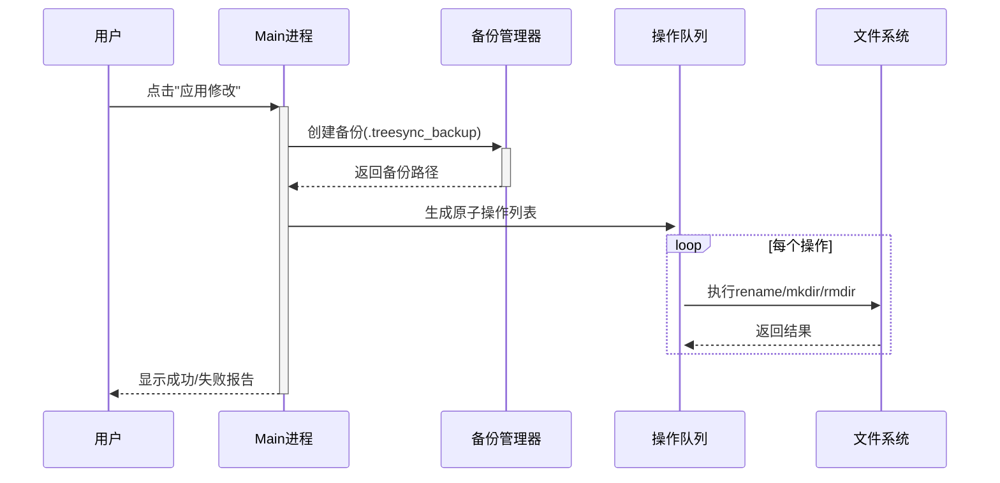

# TreeSync 技术方案设计

## 一、系统架构

### 1. 整体架构图

```plaintext
+-----------------------+
|      Renderer进程      |
| (Electron + React UI) |
+-----------------------+
|  - 目录树编辑器        |  ← 基于Monaco Editor
|  - Diff对比视图        |  ← 集成diff-match-patch
|  - 用户交互逻辑        |
+----------+------------+
           ↑ IPC通信
+----------+------------+
|       Main进程         |
| (Node.js核心逻辑)      |
+-----------------------+
|  - 文件系统操作        |  ← fs/path模块
|  - 目录树解析器        |  ← 自定义递归扫描器
|  - 备份/回滚管理器     |
+-----------------------+
```

## 二、核心模块设计

### 1. 目录树解析器

#### 输入输出

- **输入**：文件夹绝对路径  
- **输出**：标准化目录树文本（符合tree命令格式）  
- **示例**：

  ```javascript
  // 生成逻辑
  parseDirectory('/projects', {
    maxDepth: 5,          // 最大扫描深度
    exclude: /node_modules/ // 排除规则
  });
  ```

#### 关键技术点

- **递归扫描**：使用`fs.readdirSync`+`fs.statSync`遍历目录
- **符号统一化**：将Windows路径分隔符`\`转换为`/`
- **性能优化**：对10万级文件目录启用分块渲染（Web Worker）

### 2. 编辑器内核

#### Monaco Editor集成方案

```javascript
// 初始化双编辑器实例
const originalEditor = monaco.editor.create(leftPanel, {
  value: initialTreeText,
  readOnly: true,        // 左侧只读
  minimap: { enabled: false }
});

const editableEditor = monaco.editor.create(rightPanel, {
  value: initialTreeText, 
  multiCursorModifier: 'ctrlCmd', // 多光标支持
  quickSuggestions: false
});

// 实时Diff计算
editableEditor.onDidChangeModelContent(() => {
  const diffs = diff.diff_main(
    originalEditor.getValue(),
    editableEditor.getValue()
  );
  renderDiffDecorations(diffs); // 差异高亮
});
```

#### 多光标与正则替换

- **多光标**：继承Monaco原生支持（`Ctrl+Click`/`Alt+拖动`）
- **正则替换**：调用`editor.trigger`执行替换命令

  ```javascript
  editor.trigger('keyboard', 'actions.find', {
    searchString: regex,
    replaceString: replacement,
    isRegex: true
  });
  ```

### 3. 差异对比引擎

#### 定制化Diff算法

| 变更类型      | 识别策略                              |
|---------------|--------------------------------------|
| 文件重命名    | 相同路径层级+不同文件名              |
| 目录移动      | 相同文件名+父级路径变化              |
| 结构变更      | 子树整体位移检测（LCS算法优化）       |

#### 差异标记规则

```typescript
interface DiffMarker {
  type: 'add' | 'delete' | 'modify';
  lineNumber: number;
  content: string;
  // 可视化样式
  className: 'diff-add' | 'diff-del' | 'diff-mod'; 
}
```

### 4. 文件系统操作器

#### 事务性执行流程



#### 关键API

```javascript
// 原子操作类型
type FileOperation = 
  | { type: 'rename', from: string, to: string }
  | { type: 'createDir', path: string }
  | { type: 'delete', path: string };

// 执行引擎
async function applyOperations(ops: FileOperation[]) {
  const rollbackSteps = [];
  try {
    for (const op of ops) {
      const backup = await preCheck(op); // 预检查
      rollbackSteps.push(backup);
      await executeOperation(op); 
    }
  } catch (error) {
    await rollback(rollbackSteps); // 自动回滚
    throw error;
  }
}
```

## 三、关键技术决策

### 1. 跨进程通信优化

| 场景                | 技术方案                              | 数据格式          |
|---------------------|--------------------------------------|-------------------|
| 目录加载            | `ipcMain.handle` + 流式传输          | 分块JSON          |
| 实时Diff计算        | 渲染进程自主处理，避免IPC延迟         | 无                |
| 大文件操作进度反馈  | `ipcRenderer.invoke` + 事件订阅       | 进度百分比        |

### 2. 安全防护设计

- **路径校验**：禁止操作系统保护目录（如`/System`、`C:\Windows`）
- **符号链接处理**：默认跳过符号链接，提供选项开关
- **操作隔离**：沙箱模式中执行高风险操作（Electron `sandbox: true`）

## 四、性能优化策略

| 模块                | 优化手段                              | 目标指标          |
|---------------------|--------------------------------------|-------------------|
| 目录树渲染          | 虚拟滚动（react-window）             | 1万节点60fps      |
| Diff计算            | Web Worker并行计算                   | 0延迟响应         |
| 文件操作            | 异步队列 + 分批提交                  | 每秒1000+操作     |

---

## 五、测试方案

### 1. 单元测试

```javascript
// 目录解析器测试用例
test('解析嵌套目录', () => {
  const tree = parseDirectory('test/fixtures/nested');
  expect(tree).toMatchSnapshot();
});

// Diff算法测试用例
test('识别目录移动', () => {
  const oldTree = 'parent/\n└── child/';
  const newTree = 'new_parent/\n└── child/';
  const diffs = calculateStructureDiff(oldTree, newTree);
  expect(diffs[0].type).toBe('move');
});
```

### 2. 端到端测试

使用**Spectron**模拟用户操作：

```javascript
app.client
  .dragAndDrop('#drop-zone', '/test/folder')
  .waitForVisible('.editor')
  .keys(['Control', 'R']) // 触发正则替换
  .setValue('#regex-input', '\d+')
  .click('#replace-all')
  .click('#apply-changes')
  .assertDirectoryEqual('/test/folder', expectedStructure);
```

## 六、部署与维护

### 1. 打包配置

```json
// electron-builder.json
{
  "asar": true,
  "files": ["dist/**/*", "node_modules/**/*"],
  "win": {
    "target": "nsis",
    "icon": "build/icon.ico"
  },
  "mac": {
    "target": "dmg",
    "category": "public.app-category.developer-tools"
  }
}
```

### 2. 更新策略

- 自动更新：集成`electron-updater`
- 渠道管理：稳定版（Stable）与测试版（Beta）双通道
