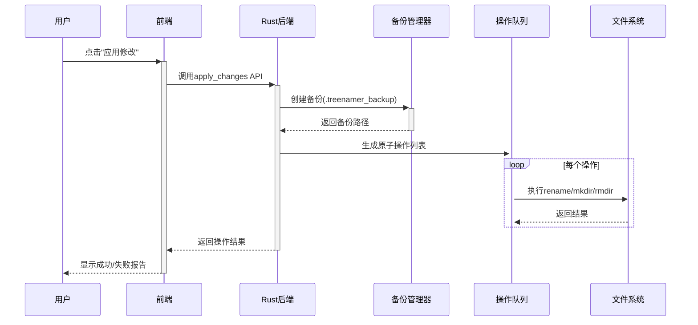

# TreeNamer 技术方案设计

## 一、系统架构

### 1. 整体架构图

```plaintext
+-------------------------+
|      前端 (Web View)     |
|     (Tauri + React UI)  |
+-------------------------+
|  - 目录树编辑器          |  ← 基于Monaco Editor
|  - Diff对比视图          |  ← 集成diff-match-patch
|  - 用户交互逻辑          |
+------------+------------+
             ↑ Tauri API 调用
+------------+------------+
|       后端 (Rust)        |
+-------------------------+
|  - 文件系统操作          |  ← std::fs模块
|  - 目录树解析器          |  ← 自定义递归扫描器
|  - 备份/回滚管理器       |
+-------------------------+
```

### 2. 项目文件结构

```
treenamer/
├── src/                      # 前端React代码
│   ├── components/           # UI组件
│   │   ├── Editor/           # Monaco编辑器组件
│   │   ├── DiffView/         # 差异可视化组件
│   │   ├── FileTree/         # 目录树组件
│   │   └── common/           # 共享UI组件
│   ├── hooks/                # 自定义React hooks
│   ├── store/                # 状态管理
│   ├── utils/                # 工具函数
│   ├── styles/               # 全局样式
│   ├── App.tsx               # 主应用组件
│   └── main.tsx              # 入口点
├── src-tauri/                # Rust后端代码
│   ├── src/
│   │   ├── main.rs           # 入口点
│   │   ├── commands/         # Tauri命令
│   │   │   ├── fs.rs         # 文件系统操作
│   │   │   ├── tree.rs       # 目录树解析
│   │   │   └── backup.rs     # 备份管理
│   │   └── utils/            # 工具函数
│   ├── Cargo.toml            # Rust依赖
│   └── tauri.conf.json       # Tauri配置
├── public/                   # 静态资源
├── tests/                    # 测试文件
│   ├── unit/                 # 单元测试
│   └── e2e/                  # 端到端测试
├── package.json              # Node.js依赖
└── README.md                 # 项目文档
```

## 二、核心模块设计

### 1. 目录树解析器

#### 输入输出

- **输入**：文件夹绝对路径  
- **输出**：标准化目录树文本（符合tree命令格式）  
- **示例**：

  ```rust
  // 生成逻辑 (Rust)
  fn parse_directory(path: &str, options: DirectoryOptions) -> Result<String, Error> {
    // 实现目录解析逻辑
  }
  
  // 前端调用 (JavaScript)
  invoke('parse_directory', { 
    path: '/projects',
    options: {
      maxDepth: 5,
      exclude: 'node_modules'
    }
  });
  ```

#### 关键技术点

- **递归扫描**：使用`std::fs::read_dir`遍历目录
- **符号统一化**：将Windows路径分隔符`\`转换为`/`
- **性能优化**：利用Rust的并行迭代器处理大型目录

### 2. 编辑器内核

#### Monaco Editor集成方案

```javascript
// 初始化双编辑器实例
const originalEditor = monaco.editor.create(leftPanel, {
  value: initialTreeText,
  readOnly: true,
  minimap: { enabled: false }
});

const editableEditor = monaco.editor.create(rightPanel, {
  value: initialTreeText, 
  multiCursorModifier: 'ctrlCmd',
  quickSuggestions: false
});

// 实时Diff计算
editableEditor.onDidChangeModelContent(() => {
  const diffs = diff.diff_main(
    originalEditor.getValue(),
    editableEditor.getValue()
  );
  renderDiffDecorations(diffs);
});
```

#### 多光标与正则替换

- **多光标**：继承Monaco原生支持（`Ctrl+Click`/`Alt+拖动`）
- **正则替换**：调用`editor.trigger`执行替换命令

  ```javascript
  editor.trigger('keyboard', 'actions.find', {
    searchString: regex,
    replaceString: replacement,
    isRegex: true
  });
  ```

### 3. 差异对比引擎

#### 定制化Diff算法

| 变更类型      | 识别策略                              |
|---------------|--------------------------------------|
| 文件重命名    | 相同路径层级+不同文件名              |
| 目录移动      | 相同文件名+父级路径变化              |
| 结构变更      | 子树整体位移检测（LCS算法优化）       |

#### 差异标记规则

```typescript
interface DiffMarker {
  type: 'add' | 'delete' | 'modify';
  lineNumber: number;
  content: string;
  className: 'diff-add' | 'diff-del' | 'diff-mod'; 
}
```

### 4. 文件系统操作器

#### 事务性执行流程



#### 关键API

```rust
enum FileOperation {
    Rename { from: String, to: String },
    CreateDir { path: String },
    Delete { path: String },
}

fn apply_operations(ops: Vec<FileOperation>) -> Result<(), Error> {
    let mut rollback_steps = Vec::new();
    
    for op in ops {
        let backup = pre_check(&op)?;
        rollback_steps.push(backup);
        execute_operation(op)?;
    }
    
    Ok(())
}

fn rollback(steps: Vec<RollbackStep>) -> Result<(), Error> {
    for step in steps.iter().rev() {
        execute_rollback(step)?;
    }
    Ok(())
}
```

## 三、技术选型决策

### 1. 前后端通信优化

| 场景                | 技术方案                              | 数据格式          |
|---------------------|--------------------------------------|-------------------|
| 目录加载            | Tauri命令API + 流式传输              | JSON              |
| 实时Diff计算        | 前端自主处理，避免跨进程延迟          | 无                |
| 大文件操作进度反馈  | Tauri事件系统                        | 进度百分比        |

### 2. 状态管理选型

| 方案 | 优势 | 劣势 | 推荐度 |
|------|------|------|--------|
| **Redux** | 成熟稳定，可预测性强，开发工具丰富 | 代码冗长，学习曲线陡峭 | ★★☆☆☆ |
| **Zustand** | 简洁，样板代码少，TypeScript支持好 | 生态系统不如Redux丰富 | ★★★★★ |
| **Context API** | React内置，无需额外依赖 | 可能导致不必要的重渲染，复杂状态下性能较差 | ★★★☆☆ |
| **Jotai** | 原子化方法，性能好 | 较新的库，生态不够成熟 | ★★★☆☆ |

**选择**: Zustand，因其简洁性、性能和TypeScript支持，非常适合本项目需求。

### 3. UI组件库选型

| 库 | 优势 | 劣势 | 推荐度 |
|----|------|------|--------|
| **Material UI** | 全面，文档完善 | 包体积大，样式较固定 | ★★★★☆ |
| **Ant Design** | 功能丰富，企业级 | 包体积大，风格特定 | ★★☆☆☆ |
| **Chakra UI** | 可访问性好，可定制，轻量 | 组件数量少于其他库 | ★★★★★ |
| **Tailwind CSS** | 实用优先，高度可定制 | 学习曲线较陡，HTML冗长 | ★★★☆☆ |

**选择**: Chakra UI，因其可访问性、可定制性和较小的包体积，这对桌面应用尤为重要。

### 4. 测试框架选型

| 框架 | 优势 | 劣势 | 推荐度 |
|------|------|------|--------|
| **Jest** | 广泛使用，功能全面 | 比新型替代品慢 | ★★★★☆ |
| **Vitest** | 快速，Vite集成，现代化 | 较新，生态系统小 | ★★★★★ |
| **Testing Library** | 组件测试，以用户为中心 | 需要与测试运行器配对 | ★★★★★ |
| **WebdriverIO** | E2E测试，浏览器自动化 | 设置复杂 | ★★★★☆ |

**选择**: Vitest + Testing Library用于单元/组件测试，WebdriverIO用于E2E测试。

### 5. 安全防护设计

- **路径校验**：禁止操作系统保护目录（如`/System`、`C:\Windows`）
- **符号链接处理**：默认跳过符号链接，提供选项开关
- **权限控制**：利用Tauri的细粒度权限系统限制文件访问范围

## 四、其他设计决策

### 1. 错误处理策略

- **错误传播**：使用Rust的`Result`类型，通过Tauri命令返回给前端
- **错误分类**：

  ```typescript
  enum ErrorType {
    PERMISSION_DENIED,
    FILE_NOT_FOUND,
    PATH_ALREADY_EXISTS,
    SYSTEM_ERROR,
    USER_ABORT
  }
  ```

- **用户反馈**：根据错误类型显示不同的UI提示（Toast、Modal等）
- **日志记录**：关键错误自动记录到本地日志文件

### 2. 国际化(i18n)方案

- **支持语言**：初期支持中文和英文
- **技术选型**：使用`react-i18next`库
- **翻译管理**：JSON格式的语言文件，按功能模块组织
- **动态切换**：运行时切换语言，无需重启应用

### 3. 主题与样式策略

- **主题支持**：内置亮色/暗色主题
- **响应系统设置**：自动检测系统主题偏好
- **样式方案**：使用Chakra UI的主题系统，CSS-in-JS方案
- **设计规范**：定义颜色、字体、间距等基础设计变量

### 4. 性能优化技术

| 模块                | 优化手段                              | 目标指标          |
|---------------------|--------------------------------------|-------------------|
| 目录树渲染          | 虚拟滚动（react-window）             | 1万节点60fps      |
| Diff计算            | Web Worker并行计算                   | 0延迟响应         |
| 文件操作            | Rust并行处理 + 异步队列              | 每秒1000+操作     |
| 大型目录加载        | 流式加载 + 进度指示                  | 10万文件<5秒      |
| 编辑器响应          | 防抖动 + 增量更新                    | 输入延迟<16ms     |

### 5. 部署与分发策略

- **打包配置**：针对不同平台优化（Windows/macOS/Linux）
- **自动更新**：集成Tauri自动更新API
- **版本控制**：语义化版本号（Semantic Versioning）
- **渠道管理**：稳定版（Stable）与测试版（Beta）双通道

### 6. 开发工作流

- **Git分支策略**：
  - `main`: 稳定版本
  - `develop`: 开发主分支
  - `feature/*`: 功能分支
  - `release/*`: 发布准备分支
  - `hotfix/*`: 紧急修复分支

- **代码质量工具**：
  - ESLint + Prettier: 代码风格和质量检查
  - Husky: Git钩子自动运行检查
  - TypeScript严格模式: 类型安全

- **CI/CD流程**：
  - GitHub Actions自动化构建
  - 自动化测试（单元测试、集成测试）
  - 自动发布到GitHub Releases

## 五、测试方案

### 1. 单元测试

```rust
#[test]
fn test_parse_nested_directory() {
    let tree = parse_directory("test/fixtures/nested", Default::default()).unwrap();
    assert!(tree.contains("nested/"));
    assert!(tree.contains("└── child/"));
}
```

```javascript
test('识别目录移动', () => {
  const oldTree = 'parent/\n└── child/';
  const newTree = 'new_parent/\n└── child/';
  const diffs = calculateStructureDiff(oldTree, newTree);
  expect(diffs[0].type).toBe('move');
});
```

### 2. 端到端测试

使用**WebdriverIO**模拟用户操作：

```javascript
it('should rename files using regex', async () => {
  await browser.url('/');
  await $('#drop-zone').setValue('/test/folder');
  await $('.editor').waitForDisplayed();
  await browser.keys(['Control', 'r']);
  await $('#regex-input').setValue('\d+');
  await $('#replace-all').click();
  await $('#apply-changes').click();
});
```

## 六、部署与维护

### 1. 打包配置

```toml
[package]
name = "treenamer"
version = "0.1.0"
edition = "2021"

[dependencies]
tauri = { version = "1.5", features = ["api-all"] }
serde = { version = "1.0", features = ["derive"] }
serde_json = "1.0"

[build-dependencies]
tauri-build = { version = "1.5", features = [] }

{
  "build": {
    "distDir": "../dist",
    "devPath": "http://localhost:3000"
  },
  "bundle": {
    "identifier": "com.treenamer.app",
    "icon": [
      "icons/32x32.png",
      "icons/128x128.png",
      "icons/128x128@2x.png",
      "icons/icon.icns",
      "icons/icon.ico"
    ]
  }
}
```

### 2. 更新策略

- 自动更新：集成Tauri自动更新API
- 渠道管理：稳定版（Stable）与测试版（Beta）双通道
